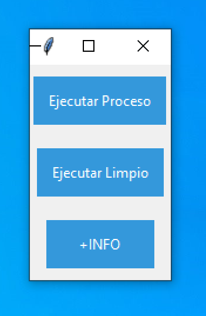

# GIG (Gestor de Internacionales de Geiser)

GIG (Gestor de Internacionales de Geiser) es una herramienta de aplicación para Windows diseñada para facilitar el proceso de conversión de archivos ZIP de Geiser a formato CSV, extrayendo y organizando los datos relevantes necesarios para la realización de trámites en el sistema SITEX. Esta herramienta está destinada a agilizar y simplificar el trabajo de los usuarios que realizan trámites internacionales, permitiéndoles gestionar eficientemente el sistema SITEX.

## Características Clave

- Conversión Rápida: GIG ha demostrado una alta eficiencia en las pruebas, procesando hasta 100 archivos ZIP en tan solo 10 segundos en equipos con procesadores Intel Core i5 y 12-16GB de RAM.
- Extracción Precisa: La herramienta extrae cuidadosamente los datos necesarios de los archivos PDF de Geiser y los organiza en un formato CSV fácilmente manejable.
- Interfaz Intuitiva: GIG presenta una interfaz de usuario intuitiva y amigable, lo que facilita su uso tanto para usuarios novatos como experimentados.
- Mejora la Gestión: Al automatizar el proceso de conversión y extracción, GIG permite a los usuarios centrarse en la gestión del sistema SITEX y otros aspectos importantes de sus trámites internacionales.

## Capturas de Pantalla

*Figura 1: Interfaz principal de GIG*

## Instalación y Uso

1. Descarga el archivo de instalación desde la sección "Releases" de este repositorio.
2. Ejecuta el archivo de instalación y sigue las instrucciones en pantalla para completar la instalación.
3. Abre GIG desde el menú de inicio o el escritorio.
4. Selecciona la ubicación de los archivos ZIP de Geiser que deseas convertir.
5. Haz clic en el botón "Convertir" para iniciar el proceso de conversión y extracción.
6. Encuentra los archivos CSV resultantes en la ubicación especificada.

## Requisitos del Sistema

- Sistema Operativo: Windows (versiones compatibles: Windows 10 y posteriores)
- Procesador: Intel Core i5 o equivalente (se recomienda para un rendimiento óptimo)
- RAM: 12GB o superior
- Espacio en Disco: 100MB de espacio libre

## Licencia

Este proyecto está bajo la Licencia Creative Commons Attribution-NonCommercial-NoDerivatives 4.0. Para más detalles, consulta el archivo [LICENSE](LICENSE).

---
Para más detalles y preguntas, contáctanos en [correo@example.com](mailto:correo@example.com).
